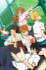
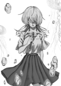
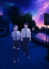
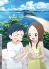

# daiku-alternatives

last updated at: `October 04, 2026 11:53 UTC`

## AniList overrides (27)

###  [`66`](https://anilist.co/anime/66) Azumanga Daioh

* accent color:  `#e28185`

###  [`2034`](https://anilist.co/anime/2034) Lovely Complex

* title: `Lovely★Complex`
* change note:
```
i like the star
```

###  [`14227`](https://anilist.co/anime/14227) My Little Monster



* cover:
  * `medium`: [anilist/14227/medium.jpg](anilist/14227/medium.jpg)
  * `large`: [anilist/14227/large.jpg](anilist/14227/large.jpg)
  * `small`: [anilist/14227/small.jpg](anilist/14227/small.jpg)
* accent color:  `#ffab44`

###  [`18661`](https://anilist.co/anime/18661) Kamisama Hajimemashita OVA

* title: `Kamisama Kiss OVA`

###  [`20837`](https://anilist.co/anime/20837) Ao Haru Ride: unwritten

* title: `Blue Spring Ride: unwritten`

###  [`20900`](https://anilist.co/anime/20900) Ao Haru Ride PAGE.13

* title: `Blue Spring Ride PAGE.13`
* accent color:  `#4ba346`

### MANGA [`54294`](https://anilist.co/manga/54294) Ao Haru Ride

* title: `Blue Spring Ride`

###  [`98033`](https://anilist.co/anime/98033) Kamisama Hajimemashita: Kamisama, Shiawase ni Naru

* title: `Kamisama Kiss: The God Will Be Happy`

###  [`101426`](https://anilist.co/anime/101426) Karakai Jouzu no Takagi-san: Water Slide


* cover:
  * `medium`: [anilist/101426/medium.jpg](anilist/101426/medium.jpg)
  * `large`: [anilist/101426/large.jpg](anilist/101426/large.jpg)
  * `small`: [anilist/101426/small.jpg](anilist/101426/small.jpg)
* title: `Teasing Master Takagi-san: Water Slide`
* change note:
```
cover is turned around & resized thumbnail from imdb
https://www.imdb.com/title/tt13069540/mediaviewer/rm1435094785/
```

### MANGA [`102423`](https://anilist.co/manga/102423) Kaguya-sama wo Kataritai

* title: `We Want to Talk About Kaguya`

###  [`104217`](https://anilist.co/anime/104217) Wotaku ni Koi wa Muzukashii OVA

* title: `Wotakoi: Love is Hard for Otaku OVA`

### MANGA [`122342`](https://anilist.co/manga/122342) Ao no Hako

* title: `Blue Box`

###  [`124080`](https://anilist.co/anime/124080) Horimiya


* cover:
  * `medium`: [anilist/124080/medium.jpg](anilist/124080/medium.jpg)
  * `large`: [anilist/124080/large.jpg](anilist/124080/large.jpg)
  * `small`: [anilist/124080/small.jpg](anilist/124080/small.jpg)
* accent color:  `#f9d58b`
* change note:
```
anilist uses cover art of end of anime, which only shows hori and miyamura
i don't like it, as it doesn't display the variety of characters in the anime
```

###  [`125367`](https://anilist.co/anime/125367) Kaguya-sama: Love is War -Ultra Romantic-


* cover:
  * `medium`: [anilist/125367/medium.jpg](anilist/125367/medium.jpg)
  * `large`: [anilist/125367/large.jpg](anilist/125367/large.jpg)
  * `small`: [anilist/125367/small.jpg](anilist/125367/small.jpg)
* accent color:  `#fa849c`

###  [`125368`](https://anilist.co/anime/125368) Kaguya-sama wa Kokurasetai: Tensaitachi no Renai Zunousen OVA

* title: `Kaguya-sama: Love is War OVA`

###  [`128643`](https://anilist.co/anime/128643) Yahari Ore no Seishun Love Come wa Machigatteiru. Kan: Dakara, Shishunki wa Owarazu ni, Seishun wa Tsuzuiteiku.

* title: `My Teen Romantic Comedy SNAFU Climax! OVA`

### MANGA [`129488`](https://anilist.co/manga/129488) Kurage no Uta



* cover:
  * `medium`: [anilist/129488/medium.jpg](anilist/129488/medium.jpg)
  * `large`: [anilist/129488/large.jpg](anilist/129488/large.jpg)
  * `small`: [anilist/129488/small.jpg](anilist/129488/small.jpg)
* title: `Song of the Jellyfish`
* change note:
```
cover from mangadex
https://mangadex.org/covers/a1c2cd9c-9e58-46ad-adb5-6ce0b354f23f/c3a90dd2-2ae1-4cea-887d-866433d57edc.png
```

###  [`130003`](https://anilist.co/anime/130003) BOCCHI THE ROCK!

* title: `Bocchi the Rock!`
* change note:
```
title: i hate full-capital titles
```

### MANGA [`140475`](https://anilist.co/manga/140475) The Fragrant Flower Blooms With Dignity

* accent color:  `#c99cb9`

###  [`143653`](https://anilist.co/anime/143653) Insomniacs After School



* cover:
  * `medium`: [anilist/143653/medium.jpg](anilist/143653/medium.jpg)
  * `large`: [anilist/143653/large.jpg](anilist/143653/large.jpg)
  * `small`: [anilist/143653/small.jpg](anilist/143653/small.jpg)
* accent color:  `#8b35c6`

### MANGA [`153520`](https://anilist.co/manga/153520) [Oshi no Ko]: Tokubetsu-hen

* title: `[Oshi no Ko]: Special Chapter (90.5)`

### MANGA [`158750`](https://anilist.co/manga/158750) Hina to Bambi

* title: `Hina and Bambi`

###  [`163327`](https://anilist.co/anime/163327) The Quintessential Quintuplets Specials

* title: `The Quintessential Quintuplets~`

###  [`170019`](https://anilist.co/anime/170019) The Angel Next Door Spoils Me Rotten2

* title: `The Angel Next Door Spoils Me Rotten Season 2`

###  [`170221`](https://anilist.co/anime/170221) The Dangers in My Heart Special


* cover:
  * `medium`: [anilist/170221/medium.jpg](anilist/170221/medium.jpg)
  * `large`: [anilist/170221/large.jpg](anilist/170221/large.jpg)
  * `small`: [anilist/170221/small.jpg](anilist/170221/small.jpg)
* title: `The Dangers in My Heart: Twi-Yaba`
* change note:
```
custom cover art by me (edit made in like 15min, that's why it's so lowres)
```

###  [`179696`](https://anilist.co/anime/179696) I Have a Crush at Work


* cover:
  * `medium`: [anilist/179696/medium.jpg](anilist/179696/medium.jpg)
  * `large`: [anilist/179696/large.jpg](anilist/179696/large.jpg)
  * `small`: [anilist/179696/small.jpg](anilist/179696/small.jpg)
* change note:
```
first cover art, seems calmer imo & colours look better
+ we didn't see most of the characters anyway
```

###  [`181444`](https://anilist.co/anime/181444) The Fragrant Flower Blooms With Dignity


* cover:
  * `medium`: [anilist/181444/medium.jpg](anilist/181444/medium.jpg)
  * `large`: [anilist/181444/large.jpg](anilist/181444/large.jpg)
  * `small`: [anilist/181444/small.jpg](anilist/181444/small.jpg)
* change note:
```
clean cover + resized to better show kaoruko & rintaro (THEY´RE SO CUTE IM CRYINHG)
non resized in o-original.jpg

images: https://kaoruhana-anime.com/assets/img/kv/img_kv2.jpg
https://s4.anilist.co/file/anilistcdn/media/anime/cover/large/bx181444-otw74fBzACfB.jpg (no idea where they managed to get a clean cover but i´m definitely stealing that)
```


## TMDB overrides (10)

### 550


* cover:
  * `medium`: [tmdb/550/medium.jpg](tmdb/550/medium.jpg)
  * `large`: [tmdb/550/large.jpg](tmdb/550/large.jpg)
  * `small`: [tmdb/550/small.jpg](tmdb/550/small.jpg)
* change note:
```
too much change on the tmdb page
```

### 120811 - as `K-ON! The Movie`


* cover:
  * `medium`: [tmdb/120811/medium.jpg](tmdb/120811/medium.jpg)
  * `large`: [tmdb/120811/large.jpg](tmdb/120811/large.jpg)
  * `small`: [tmdb/120811/small.jpg](tmdb/120811/small.jpg)
* change note:
```
from anilist entry 
https://s4.anilist.co/file/anilistcdn/media/anime/cover/large/bx9617-Z2RA1TIkcNEg.png
```

### 667520


* cover:
  * `medium`: [tmdb/667520/medium.jpg](tmdb/667520/medium.jpg)
  * `large`: [tmdb/667520/large.jpg](tmdb/667520/large.jpg)
  * `small`: [tmdb/667520/small.jpg](tmdb/667520/small.jpg)

### 776305


* cover:
  * `medium`: [tmdb/776305/medium.jpg](tmdb/776305/medium.jpg)
  * `large`: [tmdb/776305/large.jpg](tmdb/776305/large.jpg)
  * `small`: [tmdb/776305/small.jpg](tmdb/776305/small.jpg)
* change note:
```
edited (by me) cover art to remove title
```

### 896499


* cover:
  * `medium`: [tmdb/896499/medium.jpg](tmdb/896499/medium.jpg)
  * `large`: [tmdb/896499/large.jpg](tmdb/896499/large.jpg)
  * `small`: [tmdb/896499/small.jpg](tmdb/896499/small.jpg)
* change note:
```
we coulnd't really distinguish what was going on in the second cover art so i've put 1st instead
also added both textless cover arts to tmdb (low-res tho cuz of their restrictions on aspect ratio or idk what)
second one full-res available at `main2_pc.jpg`
```

### 916192


* cover:
  * `medium`: [tmdb/916192/medium.jpg](tmdb/916192/medium.jpg)
  * `large`: [tmdb/916192/large.jpg](tmdb/916192/large.jpg)
  * `small`: [tmdb/916192/small.jpg](tmdb/916192/small.jpg)

### 916224


* cover:
  * `medium`: [tmdb/916224/medium.jpg](tmdb/916224/medium.jpg)
  * `large`: [tmdb/916224/large.jpg](tmdb/916224/large.jpg)
  * `small`: [tmdb/916224/small.jpg](tmdb/916224/small.jpg)

### 938567



* cover:
  * `medium`: [tmdb/938567/medium.jpg](tmdb/938567/medium.jpg)
  * `large`: [tmdb/938567/large.jpg](tmdb/938567/large.jpg)
  * `small`: [tmdb/938567/small.jpg](tmdb/938567/small.jpg)
* change note:
```
art from the movie's website, cuz we couldn't see the characters on the other one
```

### 950387


* cover:
  * `medium`: [tmdb/950387/medium.jpg](tmdb/950387/medium.jpg)
  * `large`: [tmdb/950387/large.jpg](tmdb/950387/large.jpg)
  * `small`: [tmdb/950387/small.jpg](tmdb/950387/small.jpg)
* change note:
```
looks better with the grass
still shit movie tho
- cover from tmdb xx
```

### 1322752 - as `COLORFUL STAGE! The Movie: A Miku Who Can't Sing`

* no cover override


---
### made by [apix](https://github.com/apix0n) at [apikusu/daiku-alternatives](https://github.com/apikusu/daiku-alternatives) | this file is auto-generated
