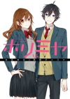
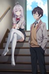
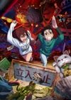
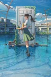

# daiku-alternatives

last updated at: `June 06, 2025 13:22 UTC`

total anilist overrides count: `54`

total tmdb overrides count: `9`

## anilist overrides

### 66

* no cover override
* accent color:  `#e28185`

### 2034 - as `Lovely★Complex`

* no cover override
* change note:
```
i like the star
```

### 14227


* cover:
  * `medium`: [anilist/14227/medium.jpg](anilist/14227/medium.jpg)
  * `large`: [anilist/14227/large.jpg](anilist/14227/large.jpg)
  * `small`: [anilist/14227/small.jpg](anilist/14227/small.jpg)
* accent color:  `#ffab44`

### 18661 - as `Kamisama Kiss OVA`

* no cover override

### 20837 - as `Blue Spring Ride: unwritten`

* no cover override

### 20900 - as `Blue Spring Ride PAGE.13`

* no cover override
* accent color:  `#4ba346`

### 54294 - as `Blue Spring Ride`

* no cover override

### 72451



* cover:
  * `medium`: [anilist/72451/medium.jpg](anilist/72451/medium.jpg)
  * `large`: [anilist/72451/large.jpg](anilist/72451/large.jpg)
  * `small`: [anilist/72451/small.jpg](anilist/72451/small.jpg)
* accent color:  `#ff548e`
* change note:
```
cover of the 16th volume, from mangadex
```

### 98033 - as `Kamisama Kiss: The God Will Be Happy`

* no cover override

### 101426 - as `Teasing Master Takagi-san: Water Slide`


* cover:
  * `medium`: [anilist/101426/medium.jpg](anilist/101426/medium.jpg)
  * `large`: [anilist/101426/large.jpg](anilist/101426/large.jpg)
  * `small`: [anilist/101426/small.jpg](anilist/101426/small.jpg)
* change note:
```
cover is turned around & resized thumbnail from imdb
https://www.imdb.com/title/tt13069540/mediaviewer/rm1435094785/
```

### 102423 - as `We Want to Talk About Kaguya`

* no cover override

### 104217 - as `Wotakoi: Love is Hard for Otaku OVA`

* no cover override

### 105334 - as `Fruits Basket`


* cover:
  * `medium`: [anilist/105334/medium.jpg](anilist/105334/medium.jpg)
  * `large`: [anilist/105334/large.jpg](anilist/105334/large.jpg)
  * `small`: [anilist/105334/small.jpg](anilist/105334/small.jpg)
* accent color:  `#eca46c`

### 117195


* cover:
  * `medium`: [anilist/117195/medium.jpg](anilist/117195/medium.jpg)
  * `large`: [anilist/117195/large.jpg](anilist/117195/large.jpg)
  * `small`: [anilist/117195/small.jpg](anilist/117195/small.jpg)
* change note:
```
cover of the last volume (from mangadex)
```

### 120377


* cover:
  * `medium`: [anilist/120377/medium.jpg](anilist/120377/medium.jpg)
  * `large`: [anilist/120377/large.jpg](anilist/120377/large.jpg)
  * `small`: [anilist/120377/small.jpg](anilist/120377/small.jpg)
* accent color:  `#f9e904`

### 122342 - as `Blue Box`

* no cover override

### 124080


* cover:
  * `medium`: [anilist/124080/medium.jpg](anilist/124080/medium.jpg)
  * `large`: [anilist/124080/large.jpg](anilist/124080/large.jpg)
  * `small`: [anilist/124080/small.jpg](anilist/124080/small.jpg)
* accent color:  `#f9d58b`
* change note:
```
anilist uses cover art of end of anime, which only shows hori and miyamura
i don't like it, as it doesn't display the variety of characters in the anime
```

### 125367


* cover:
  * `medium`: [anilist/125367/medium.jpg](anilist/125367/medium.jpg)
  * `large`: [anilist/125367/large.jpg](anilist/125367/large.jpg)
  * `small`: [anilist/125367/small.jpg](anilist/125367/small.jpg)
* accent color:  `#fa849c`

### 125368 - as `Kaguya-sama: Love is War OVA`

* no cover override

### 128643 - as `My Teen Romantic Comedy SNAFU Climax! OVA`

* no cover override

### 130003 - as `Bocchi the Rock!`


* cover:
  * `medium`: [anilist/130003/medium.jpg](anilist/130003/medium.jpg)
  * `large`: [anilist/130003/large.jpg](anilist/130003/large.jpg)
  * `small`: [anilist/130003/small.jpg](anilist/130003/small.jpg)
* change note:
```
replaced poster cuz we didn't see the band well enough
cover art comes from anime re-release as movie 'Bocchi the Rock! Re:'
title: i hate full-capital titles
```

### 132029


* cover:
  * `medium`: [anilist/132029/medium.jpg](anilist/132029/medium.jpg)
  * `large`: [anilist/132029/large.jpg](anilist/132029/large.jpg)
  * `small`: [anilist/132029/small.jpg](anilist/132029/small.jpg)
* accent color:  `#0de4d0`
* change note:
```
2de volume cover from mangadex
```

### 132182


* cover:
  * `medium`: [anilist/132182/medium.jpg](anilist/132182/medium.jpg)
  * `large`: [anilist/132182/large.jpg](anilist/132182/large.jpg)
  * `small`: [anilist/132182/small.jpg](anilist/132182/small.jpg)
* accent color:  `#2b89ec`
* change note:
```
cover of the 13th volume of the manga
comes from mangadex
```

### 140475

* no cover override
* accent color:  `#c99cb9`

### 143653


* cover:
  * `medium`: [anilist/143653/medium.jpg](anilist/143653/medium.jpg)
  * `large`: [anilist/143653/large.jpg](anilist/143653/large.jpg)
  * `small`: [anilist/143653/small.jpg](anilist/143653/small.jpg)
* accent color:  `#8b35c6`

### 149756


* cover:
  * `medium`: [anilist/149756/medium.jpg](anilist/149756/medium.jpg)
  * `large`: [anilist/149756/large.jpg](anilist/149756/large.jpg)
  * `small`: [anilist/149756/small.jpg](anilist/149756/small.jpg)
* accent color:  `#ea8889`

### 150672 - as `Oshi no Ko`

* no cover override
* change note:
```
there was a capital letter to "No" and not for the S2 it disturbed me
```

### 153520 - as `[Oshi no Ko]: Special Chapter (90.5)`

* no cover override

### 160651


* cover:
  * `medium`: [anilist/160651/medium.jpg](anilist/160651/medium.jpg)
  * `large`: [anilist/160651/large.jpg](anilist/160651/large.jpg)
  * `small`: [anilist/160651/small.jpg](anilist/160651/small.jpg)

### 162804



* cover:
  * `medium`: [anilist/162804/medium.jpg](anilist/162804/medium.jpg)
  * `large`: [anilist/162804/large.jpg](anilist/162804/large.jpg)
  * `small`: [anilist/162804/small.jpg](anilist/162804/small.jpg)
* accent color:  `#941b3f`
* change note:
```
colours look better with this one than with the anilist/main cover
```

### 163327 - as `The Quintessential Quintuplets~`

* no cover override

### 169580 - as `I Became Friends with the Second Cutest Girl in My Class`

* no cover override

### 170019 - as `The Angel Next Door Spoils Me Rotten Season 2`

* no cover override

### 170221 - as `The Dangers in My Heart: Twi-Yaba`


* cover:
  * `medium`: [anilist/170221/medium.jpg](anilist/170221/medium.jpg)
  * `large`: [anilist/170221/large.jpg](anilist/170221/large.jpg)
  * `small`: [anilist/170221/small.jpg](anilist/170221/small.jpg)
* change note:
```
custom cover art by me (edit made in like 15min, that's why it's so lowres)
```

### 170942


* cover:
  * `medium`: [anilist/170942/medium.jpg](anilist/170942/medium.jpg)
  * `large`: [anilist/170942/large.jpg](anilist/170942/large.jpg)
  * `small`: [anilist/170942/small.jpg](anilist/170942/small.jpg)
* change note:
```
2nd cover art of the anime
```

### 171018 - as `Dandadan`



* cover:
  * `medium`: [anilist/171018/medium.jpg](anilist/171018/medium.jpg)
  * `large`: [anilist/171018/large.jpg](anilist/171018/large.jpg)
  * `small`: [anilist/171018/small.jpg](anilist/171018/small.jpg)
* change note:
```
i don't like full-capital titles
```

### 171046


* cover:
  * `medium`: [anilist/171046/medium.jpg](anilist/171046/medium.jpg)
  * `large`: [anilist/171046/large.jpg](anilist/171046/large.jpg)
  * `small`: [anilist/171046/small.jpg](anilist/171046/small.jpg)
* change note:
```
3rd cover art, made with assets from https://ao-buta.com/santa/

https://ao-buta.com/santa/assets/img/main/visual03_bg.jpg
https://ao-buta.com/santa/assets/img/main/visual03_chara1.png
https://ao-buta.com/santa/assets/img/main/visual03_chara2.png
https://ao-buta.com/santa/assets/img/main/visual03_ginkgo.png
https://ao-buta.com/santa/assets/img/main/visual03_mosaic.png
```

### 171457 - as `Too Many Losing Heroines!`

* no cover override
* change note:
```
else the title was too long 💀
```

### 172463 - as `Jujutsu Kaisen: The Culling Game`

* no cover override

### 172729 - as `They are Still Being Shaken This Morning`

* no cover override

### 175443


* cover:
  * `medium`: [anilist/175443/medium.jpg](anilist/175443/medium.jpg)
  * `large`: [anilist/175443/large.jpg](anilist/175443/large.jpg)
  * `small`: [anilist/175443/small.jpg](anilist/175443/small.jpg)
* change note:
```
original image (o-original.jpg) oversaturated by 125% (saturate(1.25) in css filter terms) and zoomed in by 120% (background-size: 1.20)
cuz the colours weren't bright enough imo + characters too far

magick .\o-original.jpg -modulate 100,125 -distort SRT '1.2 0' .\original.jpg
```

### 178462


* cover:
  * `medium`: [anilist/178462/medium.jpg](anilist/178462/medium.jpg)
  * `large`: [anilist/178462/large.jpg](anilist/178462/large.jpg)
  * `small`: [anilist/178462/small.jpg](anilist/178462/small.jpg)
* change note:
```
this is the second cover image
changed cuz the anilist one (3rd) was wayy too cluttered
```

### 179696


* cover:
  * `medium`: [anilist/179696/medium.jpg](anilist/179696/medium.jpg)
  * `large`: [anilist/179696/large.jpg](anilist/179696/large.jpg)
  * `small`: [anilist/179696/small.jpg](anilist/179696/small.jpg)
* change note:
```
first ar, seems calmer imo & colours look better
+ we didn't see most of the characters anyway
```

### 180082 - as `Chitose Is in the Ramune Bottle`

* no cover override

### 181444


* cover:
  * `medium`: [anilist/181444/medium.jpg](anilist/181444/medium.jpg)
  * `large`: [anilist/181444/large.jpg](anilist/181444/large.jpg)
  * `small`: [anilist/181444/small.jpg](anilist/181444/small.jpg)
* change note:
```
clean cover + resized to better show kaoruko & rintaro (THEY´RE SO CUTE IM CRYINHG)
non resized in o-original.jpg

images: https://kaoruhana-anime.com/assets/img/kv/img_kv2.jpg
https://s4.anilist.co/file/anilistcdn/media/anime/cover/large/bx181444-otw74fBzACfB.jpg (no idea where they managed to get a clean cover but i´m definitely stealing that)
```

### 181641 - as `Alya Sometimes Hides Her Feelings in Russian Season 2`

* no cover override

### 182255 - as `Frieren: Beyond Journey’s End Season 2`

* no cover override

### 182587 - as `Oshi no Ko Season 3`

* no cover override
* change note:
```
its writing didn't match the other seasons'
```

### 186822 - as `The Guy She Was Interested in Wasn't a Guy at All`

* no cover override

### 187260 - as `I Want to Love You Till Your Dying Day`

* no cover override

### 189046 - as `Re:ZERO -Starting Life in Another World- Season 4`

* no cover override

### 189123 - as `Blue Box Season 2`


* cover:
  * `medium`: [anilist/189123/medium.jpg](anilist/189123/medium.jpg)
  * `large`: [anilist/189123/large.jpg](anilist/189123/large.jpg)
  * `small`: [anilist/189123/small.jpg](anilist/189123/small.jpg)
* change note:
```
season 1 bluray vol 2 cover, will remove when actual art is released
(the anilist cover is just a white screen with the logo)
```

### 189796 - as `Too Many Losing Heroines! Season 2`


* cover:
  * `medium`: [anilist/189796/medium.jpg](anilist/189796/medium.jpg)
  * `large`: [anilist/189796/large.jpg](anilist/189796/large.jpg)
  * `small`: [anilist/189796/small.jpg](anilist/189796/small.jpg)
* change note:
```
art by @edomondohonda3 on twitter, will remove when actual art is released
https://x.com/edomondohonda3/status/1908834863580684322
(the anilist cover is just a white screen with the logo)
```

### 190704 - as `Mistress Kanan is Devilishly Easy`

* no cover override


## tmdb overrides

### 550


* cover:
  * `medium`: [tmdb/550/medium.jpg](tmdb/550/medium.jpg)
  * `large`: [tmdb/550/large.jpg](tmdb/550/large.jpg)
  * `small`: [tmdb/550/small.jpg](tmdb/550/small.jpg)
* change note:
```
too much change on the tmdb page
```

### 667520


* cover:
  * `medium`: [tmdb/667520/medium.jpg](tmdb/667520/medium.jpg)
  * `large`: [tmdb/667520/large.jpg](tmdb/667520/large.jpg)
  * `small`: [tmdb/667520/small.jpg](tmdb/667520/small.jpg)

### 776305


* cover:
  * `medium`: [tmdb/776305/medium.jpg](tmdb/776305/medium.jpg)
  * `large`: [tmdb/776305/large.jpg](tmdb/776305/large.jpg)
  * `small`: [tmdb/776305/small.jpg](tmdb/776305/small.jpg)
* change note:
```
edited (by me) cover art to remove title
```

### 896499


* cover:
  * `medium`: [tmdb/896499/medium.jpg](tmdb/896499/medium.jpg)
  * `large`: [tmdb/896499/large.jpg](tmdb/896499/large.jpg)
  * `small`: [tmdb/896499/small.jpg](tmdb/896499/small.jpg)
* change note:
```
we coulnd't really distinguish what was going on in the second cover art so i've put 1st instead
also added both textless cover arts to tmdb (low-res tho cuz of their restrictions on aspect ratio or idk what)
second one full-res available at `main2_pc.jpg`
```

### 916192


* cover:
  * `medium`: [tmdb/916192/medium.jpg](tmdb/916192/medium.jpg)
  * `large`: [tmdb/916192/large.jpg](tmdb/916192/large.jpg)
  * `small`: [tmdb/916192/small.jpg](tmdb/916192/small.jpg)

### 916224



* cover:
  * `medium`: [tmdb/916224/medium.jpg](tmdb/916224/medium.jpg)
  * `large`: [tmdb/916224/large.jpg](tmdb/916224/large.jpg)
  * `small`: [tmdb/916224/small.jpg](tmdb/916224/small.jpg)

### 938567


* cover:
  * `medium`: [tmdb/938567/medium.jpg](tmdb/938567/medium.jpg)
  * `large`: [tmdb/938567/large.jpg](tmdb/938567/large.jpg)
  * `small`: [tmdb/938567/small.jpg](tmdb/938567/small.jpg)
* change note:
```
ar from the movie's website, we couldn't see the characters so bad
```

### 950387


* cover:
  * `medium`: [tmdb/950387/medium.jpg](tmdb/950387/medium.jpg)
  * `large`: [tmdb/950387/large.jpg](tmdb/950387/large.jpg)
  * `small`: [tmdb/950387/small.jpg](tmdb/950387/small.jpg)
* change note:
```
looks better with the grass
still shit movie tho
- cover from tmdb xx
```

### 1322752 - as `COLORFUL STAGE! The Movie: A Miku Who Can't Sing`

* no cover override


---
### made by [apix](https://github.com/apix0n) at [apikusu/daiku-alternatives](https://github.com/apikusu/daiku-alternatives) | this file is auto-generated
